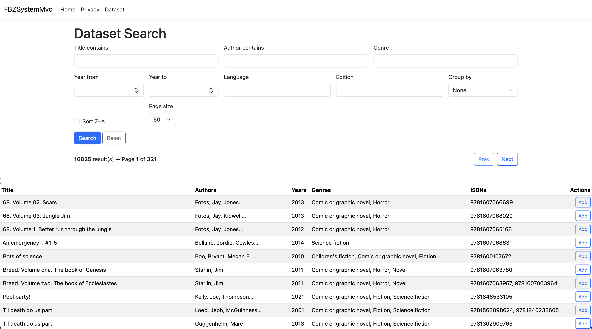

# FBZ Encyclopedia  
A C# project for loading, searching, filtering, sorting, grouping, and displaying comic data from a CSV dataset.

This repo contains:
- **WinForms app (Windows-only)** — the original FBZSystem desktop application.
- **ASP.NET Core MVC app (cross-platform)** — a web-based port in **`/FBZSystemMvc`** that runs locally on macOS/Windows.

---

## 🖼️ Screenshot (ASP.NET Core MVC)


---

## 📘 Overview
FBZ Encyclopedia provides a lightweight and responsive way to explore a comic dataset.

All data operations—loading, searching, formatting, and history/list management—are separated into dedicated classes for maintainability and clarity. The UI stays clean, while the logic is handled by services and strategy patterns behind the scenes.

---

## 🔎 Key Features
### WinForms (Original)
- CSV data loading using a repository class (`ComicRepositoryCsv`)
- Search functionality with multiple filters
- Sorting and grouping via plug-in strategy classes
- Search history tracking with record/clear functionality
- Consistent display output using a formatter class
- Separated UI, logic, and data layers
- SOLID principles applied across services and interfaces

### ASP.NET Core MVC (New)
Located in: **`/FBZSystemMvc`**

- Web-based **Dataset Search** page
- Filters: title, author, genre, year range, language, edition
- Sorting: title A–Z / Z–A
- Grouping: none / author / year
- **Paging + page size** selection (prevents loading huge tables at once)
- **Session-based Search List** (Add / Remove / Clear)
- Runs locally on macOS using the .NET SDK (no Visual Studio required)

---

## ▶️ Run Locally (ASP.NET Core MVC)
### Prerequisites
- .NET SDK installed (check with `dotnet --version`)

### Steps
```bash
cd FBZSystemMvc
dotnet restore
dotnet run
````

Then open the URL shown in the terminal (usually `http://localhost:####`) and go to:

* `/Dataset`

---

## 🪟 Run (WinForms - Windows Only)

The original WinForms app targets Windows. To run it:

* Open the solution on Windows (Visual Studio)
* Build and run the WinForms project

---

## 📁 Project Structure

* `Data/` — CSV dataset files
* `Domain/` — domain models / core logic
* `Repositories/` — data access (CSV repository)
* `Services/` — search, history/list management, orchestration logic
* `Strategies/` — sorting and grouping strategies
* `FBZSystemMvc/` — ASP.NET Core MVC web app (cross-platform)

---

## 🧩 SOLID Principles Guide

This project includes multiple examples of all five SOLID principles.
Each example is marked directly in the code using `//` comments.

### **S — Single Responsibility Principle**

* `ComicRepositoryCsv` — loads and parses CSV data
* `SearchService` — search, filter, sort, group logic
* `SearchHistoryService` / Search list storage — manages search history / list state
* `ComicFormatter` — creates display strings
* UI (WinForms / MVC views) — presentation only

### **O — Open/Closed Principle**

* Sorting strategies (`SortTitleAscendingStrategy`, `SortTitleDescendingStrategy`)
* Grouping strategies (`GroupByAuthorStrategy`, `GroupByYearStrategy`)
* New strategies can be added without changing the search engine code.

### **L — Liskov Substitution Principle**

* Any `ISortStrategy` works in the search engine
* Any `IGroupingStrategy` works with the same calls
* The repository could be replaced (CSV → SQL → API)

### **I — Interface Segregation Principle**

* `IComicRepository`
* `ISearchService`
* `ISearchHistoryService` (and other small focused interfaces)

### **D — Dependency Inversion Principle**

* UI depends on abstractions (interfaces), not concrete classes
* Services depend on strategy interfaces, not implementations
* Composition/wiring happens in one place

---

## 🛠️ Technologies Used

* C# (.NET)
* WinForms
* ASP.NET Core MVC
* CSV datasets
* LINQ
* Strategy pattern (sorting/grouping)
* Deedle

---

## 👤 Author

**Aman – HND Cloud & AI Computing**
